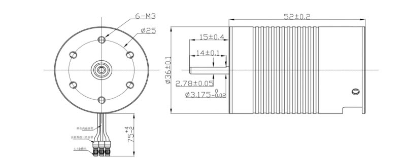

# 3D_Robot_base
 
## Parts
* Nema 11HS18-0674S :
    * [Achat](https://www.gotronic.fr/art-moteur-11hs18-0674s-23047.htm)
    * [Drawings](https://www.gotronic.fr/pj2-31113-11hs18-0674s-2566.pdf)
* Bille 3/4" :
    * [Achat](https://www.gotronic.fr/art-roue-libre-3-4-955-21789.htm)
* Combo Motorisation Brushless Ten Moteur 3652 3000kV - Controleur 50A - ROBR01250
    * [Achat](https://www.miniplanes.fr/combo-motorisation-brushless-ten-moteur-3652-3000kv-controleur-50a-robr01250)
    * Dimension Moteur : L 52mm / D 36 mm
    * Axe moteur : 3.17mm x 15mm
    * Dimension ESC : 48.5mm L / 38.00 mm l / 32.00 mm H
* Gensace Accu Lipo 4500mAh 11.1V 3S 60C - B-60C-4500-3S1P-HardCase-24 
    * [Achat](https://www.miniplanes.fr/gensace-accu-lipo-4500mah-111v-60c-3s-b-60c-4500-3s1p-hardcase-24-gea45003s60x9)
    * Dimension : 139mm L / 47 mm l / 25mm H
* Paire de roues 136mm DGR136
    * [Achat](https://www.gotronic.fr/art-paire-de-roues-136-mm-dgr136-20584.htm)
* 196-4802 - Joint torique RS PRO, Ø int. 50.39mm, Ø ext. 57.45mm, épais. 3.53mm, en Caoutchouc Nitrile
    * [Achat](https://fr.rs-online.com/web/p/joints-et-joints-toriques/1964802)
* 286-4503 - Poulie pour courroie crantée en Aluminium 12 dents , pas de 2.5mm, alésage 3mm
    * [Achat](https://fr.rs-online.com/web/p/poulies/2864503)
* 286-4597 - Poulie pour courroie crantée en Aluminium 36 dents , pas de 2.5mm, alésage 6mm
    * [Achat](https://fr.rs-online.com/web/p/poulies/286-4597)
* 474-5117 - Courroie synchrone Contitech Polyuréthane, 305mm x 6mm, 122 dents
    * [Achat](https://fr.rs-online.com/web/p/courroies-synchrones/474-5117)
* 619-0014 - Roulement à billes miniature RS PRO, ø int. 6mm, ø ext. 19mm, larg. 6mm
    * [Achat](https://fr.rs-online.com/web/p/roulements-a-billes/619-0014)

## Datasheets

* Moteur 3652

